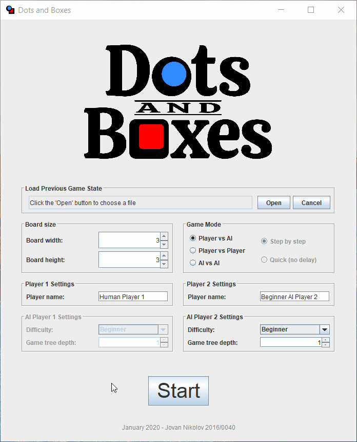

# DotsNBoxes
A Dots and Boxes game implemented in Java for a course in Intelligent Systems.

## Examples

The following example contains a single game against a beginner AI player on a 3x3 board.

## Project status

Currently the project is on hold. The main functionality is done, however the performance of the AI player is low. The reason being is that the implementation of the AI is done recursively with each step having its own copy of the board state. This causes exponential time and memory complexity with increase of board size.

The next step would be to implement the algorithm iteratively without copying the board state. This would dramatically improve memory complexity while also improving time complexity due to avoiding making copies of the whole board for each move. However, this was put on hold, and possibly will not be implemented due to the lack of time and interest. Feel free to take a look at the code and the documentation (currently only in Serbian) if you want to improve the implementation.